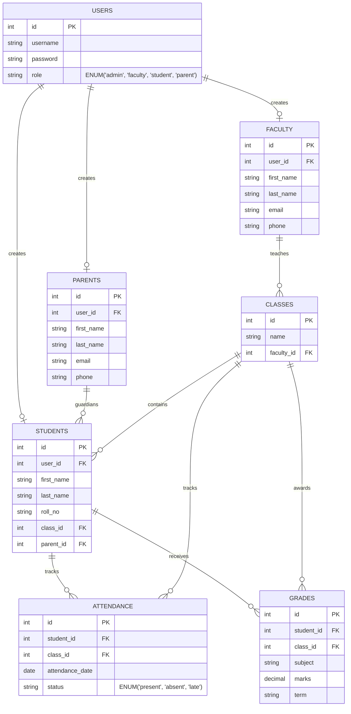

# Database Entity-Relationship Diagram

*You can include this diagram in your final project report to visualize the database architecture.*

```mermaid
erDiagram
    USERS ||--o| FACULTY : creates
    USERS ||--o| PARENTS : creates
    USERS ||--o| STUDENTS : creates
    FACULTY ||--o{ CLASSES : teaches
    PARENTS ||--o{ STUDENTS : guardians
    CLASSES ||--o{ STUDENTS : contains
    STUDENTS ||--o{ ATTENDANCE : tracks
    CLASSES ||--o{ ATTENDANCE : tracks
    STUDENTS ||--o{ GRADES : receives
    CLASSES ||--o{ GRADES : awards

    USERS {
        int id PK
        string username
        string password
        string role "ENUM('admin', 'faculty', 'student', 'parent')"
    }
    FACULTY {
        int id PK
        int user_id FK
        string first_name
        string last_name
        string email
        string phone
    }
    PARENTS {
        int id PK
        int user_id FK
        string first_name
        string last_name
        string email
        string phone
    }
    CLASSES {
        int id PK
        string name
        int faculty_id FK
    }
    STUDENTS {
        int id PK
        int user_id FK
        string first_name
        string last_name
        string roll_no
        int class_id FK
        int parent_id FK
    }
    ATTENDANCE {
        int id PK
        int student_id FK
        int class_id FK
        date attendance_date
        string status "ENUM('present', 'absent', 'late')"
    }
    GRADES {
        int id PK
        int student_id FK
        int class_id FK
        string subject
        decimal marks
        string term
    }
```
